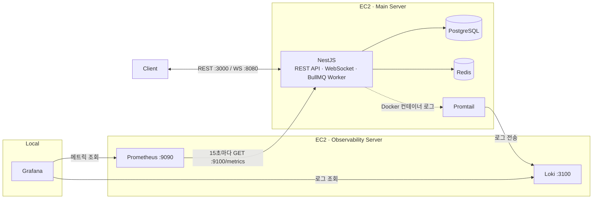
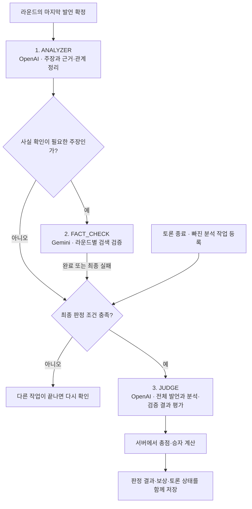
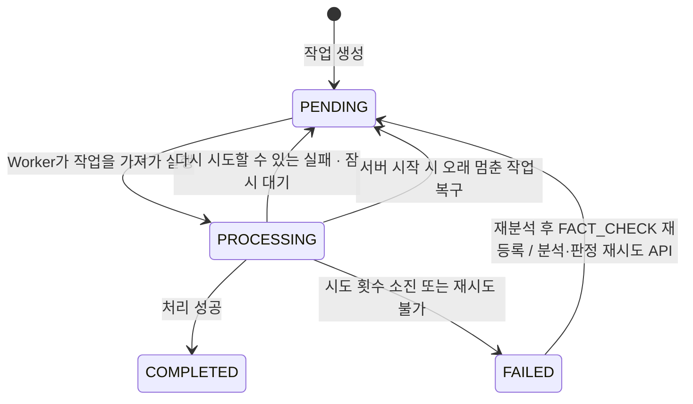
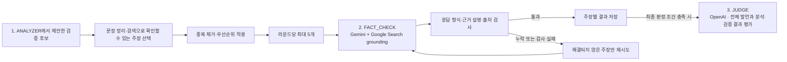

# Heimdall Backend

실시간 토론을 진행하고, AI로 발언을 분석해 점수·승자·피드백을 제공하는 NestJS 백엔드입니다.
토론 중에는 라운드마다 주장과 근거를 정리하고 사실 여부를 검색으로 확인합니다. 토론이 끝나면 전체 발언과 검증 결과를 모아 최종 판정을 내립니다.

시간이 걸리는 AI 작업은 큐에 넣어 백그라운드에서 처리합니다. 사용자는 분석이 끝날 때까지 기다리지 않고 토론을 이어갈 수 있습니다.

## 기술 스택

| 영역 | 기술 | 역할 |
| --- | --- | --- |
| 애플리케이션 | Node.js 24, TypeScript, NestJS 11 | API와 백그라운드 작업 실행 |
| 데이터 | PostgreSQL 17, TypeORM 1.0 | 토론·확정 발언·분석·판정 결과 저장 |
| 실시간·큐 | WebSocket, Redis 7, BullMQ 6 | 실시간 채팅, 임시 발언 저장, 중복·동시 처리 제어, 작업 대기열 |
| AI | OpenAI Responses API, Gemini API + Google Search grounding, Zod | 발언 분석·판정, 검색을 통한 사실 검증, AI 응답 형식 검사 |
| API 계약·인증 | Swagger, class-validator, Passport, JWT, Google OAuth | 요청 검증, API 명세, 사용자 인증 |
| 인프라·관측 | AWS EC2, Docker Compose, GitHub Actions, Prometheus, Loki, Promtail, Grafana | 배포, 메트릭·로그 수집 및 시각화 |
| 테스트 | Jest | 서비스·저장소의 상태 변경과 처리 규칙 검증 |

## 인프라 구조

EC2 두 대를 사용합니다. Main Server는 서비스를 실행하고, Observability Server는 성능 지표와 로그를 모아 저장합니다. 개발자는 로컬 Grafana에서 두 데이터를 조회합니다.

- **Main Server**: NestJS API와 BullMQ Worker가 같은 프로세스에서 실행됩니다. PostgreSQL과 Redis 데이터는 컨테이너를 다시 만들어도 남도록 볼륨에 저장합니다. Redis는 변경 내용을 파일에 기록하는 AOF도 사용합니다.
- **Observability Server**: Prometheus는 Main Server의 사설 IP에 15초마다 접속해 지표를 가져옵니다. Promtail은 컨테이너 로그를 읽어 Loki로 보냅니다. 지표는 15일 또는 5GB 중 먼저 도달하는 제한에 따라 정리하고, 로그는 14일 보관합니다.
- **접근 포트 분리**: API·WebSocket·메트릭에 서로 다른 포트를 사용해 메트릭 포트의 접근 권한을 따로 제한할 수 있습니다. PostgreSQL·Redis의 호스트 포트는 `127.0.0.1`에 연결해 외부에서 직접 접속하지 못하게 합니다.

구성 파일: [Main Server](docker-compose.yml) · [로그 수집](promtail-config.yml) · [Observability Server](temp_observability/docker-compose.yml) · [메트릭 수집](temp_observability/prometheus.yml) · [로그 저장](temp_observability/loki-config.yml)

## 코드 구조와 역할

하나의 NestJS 애플리케이션 안에서 기능별로 모듈을 나눕니다. 토론을 진행하는 코드, AI를 호출하는 코드, 결과를 저장하고 보상을 반영하는 코드가 각각의 역할을 맡습니다.

| 모듈 | 책임 |
| --- | --- |
| `auth`, `members` | 인증·토큰 및 회원 관리 |
| `communities`, `member-communities`, `community-chat` | 커뮤니티·참여 관계·채팅 |
| `debates`, `debate-invitations`, `debate-chat` | 토론 생성·초대·발언 순서·제한 시간·실시간 상태 |
| `judge` | AI 작업 등록·실행, 발언 분석, 팩트체크, 최종 판정 |
| `debate-outcomes` | 종료 결과에 따른 보상·시스템 메시지·커뮤니티 상태 반영 |
| `common` | 사용자 인증 정보, 요청 검증·오류 응답, Redis 연결, WebSocket 처리, 지표 수집 |

## BullMQ 3단계 파이프라인

AI 처리는 **1. ANALYZER → 2. FACT_CHECK → 3. JUDGE**의 세 단계로 나뉩니다. 작업은 Redis의 **단일 `debate-judge` 큐**에 등록하고, Worker가 꺼내 실행합니다. 분석과 사실 검증은 라운드마다 진행하고, 최종 판정은 토론이 끝난 뒤 진행합니다.

`1. ANAYZER`의 분석 결과는 주장·근거·질문·반박과 이들 사이의 관계를 연결한 **논증 그래프**로 저장합니다. 어떤 발언이 상대 주장을 뒷받침하거나 반박했는지 판정에 활용하기 위한 구조입니다.

| 단계 | 처리 단위 | 핵심 처리 |
| --- | --- | --- |
| `1. ANALYZER` | 발언이 있는 라운드 | 현재 발언과 이전 분석 결과를 AI에 전달해 논증 그래프를 만듭니다. 서버는 없는 주장을 가리키거나, 앞선 발언이 나중 발언에 답하는 등 잘못 연결된 결과를 걸러냅니다. |
| `2. FACT_CHECK` | 라운드별 최대 5개 주장 | 서버가 고른 주장을 한 번의 AI 호출로 묶어서 검증합니다. 검사를 통과한 결과는 저장하고, 실패하거나 빠진 주장만 다시 요청합니다. |
| `3. JUDGE` | 토론 전체 | 전체 발언과 분석·검증 결과를 AI에 전달해 논증력, 상호작용, 사실 신뢰도를 평가합니다. 서버는 점수가 0~100 사이의 정수인지 검사합니다. |

**`3. JUDGE`의 시작 조건**: 토론이 끝나고, 모든 분석이 성공했으며, 대기·실행 중인 분석·검증 작업이 없을 때 시작합니다. 분석이 최종 실패하면 판정을 중단합니다. 사실 검증만 실패했다면 확보한 결과로 판정을 진행하며, 확인하지 못한 주장을 거짓으로 처리하지 않습니다.

**총점과 승자는 서버가 결정합니다.** AI가 낸 항목별 점수에 `round(논증력 × 0.4 + 상호작용 × 0.3 + 사실 신뢰도 × 0.3)`을 적용하고, 총점이 같으면 무승부로 처리합니다. 판정 결과·토론 완료 상태·회원 신뢰도 차감·승리 보상·시스템 메시지·커뮤니티 복귀는 하나의 DB 트랜잭션으로 저장합니다. 저장이 끝나면 접속 중인 클라이언트에 결과를 알립니다.

### AI Worker가 하는 일

**AI Worker는 큐에서 작업을 꺼내 실행하고, 성공·실패·재시도를 관리합니다.** 실제 AI 호출과 결과 검사는 단계별 Handler가 맡습니다.

| 구성 요소 | 하는 일 |
| --- | --- |
| `JudgeService` | 어떤 작업이 필요한지, 최종 판정을 시작해도 되는지 결정 |
| `JudgeTaskQueue` | 큐에 작업 ID인 `taskId` 등록 |
| `JudgeTaskWorker` | 작업을 가져와 처리기 실행, 시간 제한·재시도·상태 변경 관리 |
| `JudgeTaskHandler` 구현체 | 각 단계의 AI 호출과 분석·검증·판정 로직 수행 |

예를 들어 `1. ANALYZER` 작업을 가져오면 Worker가 `ArgumentAnalyzerService`를 실행합니다. 이 서비스가 OpenAI를 호출하고 분석 결과를 저장하면, Worker는 작업을 완료 처리하고 `JudgeService`에 알려 최종 판정 조건을 다시 확인하게 합니다.

### AI Worker 작업 상태

세 단계의 각 작업은 DB의 `JudgeTask`에 아래 상태로 기록됩니다. 한 라운드의 분석이 `COMPLETED`여도 다른 라운드의 분석이나 최종 판정은 남아 있을 수 있습니다.

| 상태 | 의미 |
| --- | --- |
| `PENDING` | 실행을 기다리는 상태. 실패 후 다시 실행하기 전의 대기 시간도 포함합니다. |
| `PROCESSING` | Worker가 가져가 실행 중인 상태. 시도 횟수(`attempt`)와 이번 실행의 식별자(`requestId`)를 기록합니다. |
| `COMPLETED` | 해당 작업을 성공적으로 끝낸 상태. 같은 작업이 다시 전달되면 건너뜁니다. |
| `FAILED` | 허용된 시도를 모두 실패했거나 다시 해도 해결되지 않는 오류로 끝난 상태. 자동 재시도를 멈춥니다. |

자동 재시도나 서버 시작 시 복구에서는 지금까지의 시도 횟수를 유지합니다. 재시도 API로 다시 시작하거나 재분석 후 `2. FACT_CHECK`를 새로 등록할 때는 시도 횟수를 0으로 되돌립니다. 클라이언트에 보내는 `RETRYING` 알림은 DB에서는 `PENDING`에 해당합니다.

### 재시도와 중복 처리

- **같은 작업의 중복 등록 방지**: DB에서 작업 종류와 대상의 조합 `(kind, target_id)`이 중복되지 않도록 하고, 큐에서도 `taskId`를 `jobId`로 사용합니다. 큐에는 ID만 넣고, 실행에 필요한 데이터는 DB에서 다시 읽습니다.
- **작업을 가져간 실행만 상태 변경**: DB에서 아직 `PENDING`인 경우에만 `PROCESSING`으로 바꿉니다. 완료·실패 처리 때도 `requestId`가 같은지 확인해 이전 시도가 뒤늦게 작업 상태를 바꾸지 못하게 합니다.
- **실패하면 간격을 두고 재시도**: 기본 설정은 동시에 2개 실행, 작업당 제한 시간 120초입니다. 실패하면 5초부터 대기 시간을 두 배씩 늘리는 지수 backoff를 적용합니다. 첫 실행을 포함해 분석·검증은 최대 3회, 판정은 최대 2회 시도합니다. 다시 해도 해결되지 않는 입력 오류는 바로 실패 처리합니다.
- **중단된 작업 복구**: 서버 시작 시 제한 시간의 3배보다 오래 `PROCESSING`에 남은 작업을 `PENDING`으로 되돌리고 큐에 다시 넣습니다. 분석·판정이 최종 실패한 경우에는 재시도 API로 다시 시작할 수 있으며, 기본 대기 시간은 300초입니다.
- **보상 중복 지급 방지**: 최종 판정은 아직 판정 가능한 토론 상태일 때만 저장합니다. 이미 완료된 토론에 같은 작업이 도착해도 보상이나 신뢰도 차감을 다시 적용하지 않습니다.

구현: [파이프라인 조정](src/judge/judge.service.ts) · [큐·Worker](src/judge/judge-task.worker.ts) · [작업 저장소](src/judge/judge-task.repository.ts)

## 2. FACT_CHECK 상세 흐름

`1. ANALYZER`가 사실 확인이 필요하다고 표시한 주장(`needsFactCheck`) 중에서 서버가 실제 검색할 대상을 고릅니다. `2. FACT_CHECK`가 검색하고 결과를 저장하면, `3. JUDGE`가 이를 판정 근거로 사용합니다.

1. **검색할 주장 선택**: 수치·통계·인용 자료가 있는 주장을 우선하고, 날짜·사건·법·제도·역사·과학적 사실을 확인합니다. 개인 의견이나 가치 판단, 상대 발언에 대한 평가, 확인할 근거가 없는 추측은 제외하고 그 이유를 남깁니다.
2. **같은 주장 반복 검색 방지**: 문자 표기를 통일하는 NFKC 정규화 후 공백·문장부호·대소문자 차이를 없애고, SHA-256 해시로 같은 문장인지 비교합니다. 표현만 다른 동일 주장은 Analyzer의 `duplicateOfRef`로 원본과 연결해 기존 검증 결과를 재사용합니다.
3. **검색으로 근거 확인**: 토론 주제와 발언 맥락, 확인할 주장을 Gemini에 전달합니다. Gemini는 Google Search로 근거를 찾아 뒷받침됨(`SUPPORTED`), 반대 근거 있음(`CONTRADICTED`), 일부 뒷받침됨(`PARTIALLY_SUPPORTED`), 자료 부족(`INSUFFICIENT_EVIDENCE`), 검증 불가(`NOT_VERIFIABLE`), 오래된 정보(`OUTDATED`) 중 하나로 답합니다.
4. **출처와 설명 검사**: 자료 부족·검증 불가를 제외하면 출처가 최소 1개 있어야 합니다. 서버는 HTTP(S) URL 형식을 검사하고, 최소 한 출처의 도메인이 Google 검색 근거 정보(grounding)에 있거나 그 하위 도메인인지 확인합니다. 검색 근거와 일치하는 출처를 우선해 최대 3개 저장하며, 근거 설명이 비어 있거나 승패 조언 등이 섞인 결과는 거릅니다.
5. **실패한 주장만 다시 확인**: 예를 들어 5개 중 3개가 검사를 통과하면 먼저 저장합니다. 나머지 2개만 허용된 시도 횟수 안에서 다시 검증해 이미 성공한 검색을 반복하지 않습니다.

현재 출처 검사는 **검색 근거에 나온 도메인인지 확인하는 수준**입니다. 서버가 출처 페이지의 본문을 직접 읽고 주장과 대조하지는 않습니다.

구현: [대상 선별 정책](src/judge/fact-check-target.policy.ts) · [팩트체크 서비스](src/judge/fact-checker.service.ts) · [Gemini 어댑터](src/judge/llm/gemini-fact-checker.ts)

## 운영 중 확인하는 지표

어느 요청이 느린지, AI 작업이 얼마나 실패하는지, 토큰을 얼마나 사용하는지 확인할 수 있도록 `prom-client`로 지표를 수집합니다. Prometheus는 API와 같은 프로세스에 열린 전용 주소 `:9100/metrics`에서 이 값을 가져갑니다.

| 관측 대상 | 수집 항목 |
| --- | --- |
| HTTP | 메서드·라우트·상태 코드별 요청 수와 처리 시간 |
| WebSocket | 현재 연결 수, 명령 종류별 성공·실패 및 처리 시간 |
| 판정 파이프라인 | 단계별 완료·재시도·실패 횟수, 처리기 실행 시간 |
| LLM | 공급자·모델·작업별 호출 시간과 결과, 입력·출력·캐시·사고 토큰 사용량 |
| Node.js | CPU·메모리·이벤트 루프 지연·GC |

지표를 요청마다 따로 만들지 않도록 실제 URL 대신 `/debates/:id` 같은 라우트 패턴으로 묶고, WebSocket도 등록된 명령 종류로 묶습니다. 개별 작업은 로그의 `taskId`, `jobId`, `attempt`로, AI 호출은 `debateId`와 호출 정보로 Loki에서 추적합니다. 파이프라인 실행 시간에는 큐에서 기다린 시간과 재시도 전 대기 시간은 포함하지 않습니다.
